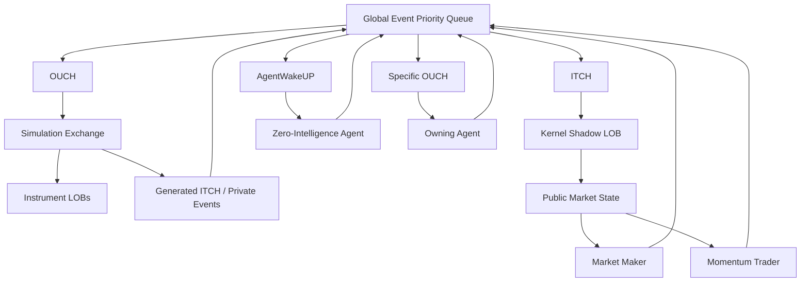

# TALON

A deterministic event-driven framework for latency-aware agent-based limit order book simulation.

TALON is a C++ discrete-event market simulation kernel built around a global event scheduler, instrument-level exchange processing clocks, an exchange-side matching engine, and a kernel-maintained shadow limit order book.

The current implementation provides a high-performance environment for studying event ordering, exchange processing time, information availability, and agent reactions in a limit order book.

## Table of Contents
- [Why TALON](#why-talon)
- [Architecture](#architecture)
- [Exchange and Public Market State](#exchange-and-public-market-state)
- [Event Scheduling](#event-scheduling)
- [Current Agent Models](#current-agent-models)
- [Base LOB Engine](#base-lob-engine)
- [Repository Structure](#repository-structure)
- [Build](#build)
- [Run](#run)
- [Performance & Hardware Profiling](#performance--hardware-profiling)
- [Look-Ahead Leakage](#look-ahead-leakage)
- [Related Projects](#related-projects)
- [Research](#research)
- [License](#license)

---

# Why TALON

In a latency-aware market simulation, the order in which events are processed is part of the model.

An agent reacting to a public market event should only see the market state that was available through that event. At the same time, an order submitted by one agent should not be allowed to affect another instrument's processing timeline simply because both instruments share the same simulation.

TALON addresses these problems with three main mechanisms:

- **Global Discrete-Event Scheduler:** For deterministic event ordering by timestamp and sequence number.
- **Instrument-Level Clocks:** An independent processing clock for each instrument preventing cross-symbol temporal coupling.
- **Kernel Shadow LOB:** A kernel-maintained shadow limit order book representing the public market state available to agents.

The exchange-side book remains authoritative for matching. The shadow book reconstructs the public state event by event before reactive agents are evaluated.

The detailed architectural derivation, latency analysis, and empirical look-ahead evaluation are described in the accompanying paper.

---

# Architecture



The kernel is the routing layer around the global priority queue.

Events are processed according to:

```text
(timestamp, sequence_number)

```

The timestamp determines event time. The sequence number provides a deterministic ordering when multiple events share the same timestamp.

The main event paths are:

| Event | Kernel action |
| --- | --- |
| `OUCH` | Send an agent request to the simulation matching engine |
| `ITCH` | Update the public shadow LOB and evaluate reactive agents |
| `S_OUCH` | Route a private exchange response through the agent path |
| `AgentWakeUP` | Wake an independently scheduled agent and schedule its next action |

---

# Exchange and Public Market State

TALON keeps two LOB roles separate.

```text
                    +----------------------+
                    |   Global Event Queue |
                    +----------+-----------+
                               |
              +----------------+----------------+
              |                                 |
              v                                 v
      +---------------+                 +---------------+
      | Exchange LOB  |                 |  ITCH Events  |
      |   Matching    |                 +-------+-------+
      +-------+-------+                         |
              |                                 v
              |                         +---------------+
              |                         | Shadow LOB    |
              |                         | Public State  |
              |                         +-------+-------+
              |                                 |
              |                                 v
              |                         +---------------+
              |                         | Reactive      |
              |                         | Agents        |
              |                         +-------+-------+
              |                                 |
              +----------------<----------------+

```

The simulation-mode engine is authoritative for order matching.

The parser-mode engine is maintained by the kernel and reconstructs the public market state from the generated ITCH event stream.

This separation prevents reactive agents from directly reading an exchange book that may already contain changes from later events.

---

# Event Scheduling

Agent actions are represented as events rather than being executed immediately when an agent is evaluated.

For a reactive agent, the basic path is:

```text
Public ITCH event
        |
        v
Agent receives market information
        |
        v
Agent evaluates its strategy
        |
        v
Future OUCH request is scheduled
        |
        v
Global event queue
        |
        v
Exchange gateway
        |
        v
Instrument-level matching engine

```

This makes the simulated timing of agent actions part of the event stream rather than an implicit consequence of agent iteration order.

The exchange also maintains an independent processing clock for each instrument. Processing one instrument therefore does not automatically advance the processing state of another.

---

# Current Agent Models

TALON currently includes three agent styles.

| Agent | Trigger | Current behaviour |
| --- | --- | --- |
| Zero-Intelligence | Independent wake-up | Generates stochastic limit-order flow around the current midpoint |
| Market Maker | Public ITCH events | Maintains quotes around a drifting reference value with inventory adjustment |
| Momentum Trader | Public execution events | Reacts to recent price movement subject to a position limit |

The benchmark population uses:

* **Zero-Intelligence (ZI):** 100 agents, 1,000 orders/sec
* **Market Makers (MM):** 20 agents
* **Momentum Traders:** 5 agents

---

# Base LOB Engine

TALON uses [Base LOB Engine](https://github.com/pankajj6/base_lob_engine) as its reusable limit order book submodule and matching layer.

Base LOB Engine provides pooled order storage, direct order-ID lookup, price-level FIFO queues, price-time-priority matching, multi-symbol book maintenance, per-symbol processing clocks, and deterministic event metadata.

The engine exposes two main operation paths:

```text
itch_*   -> direct observed-book reconstruction
ouch_*   -> request processing and matching

```

---

# Repository Structure

```text
.
├── agents/
│   ├── mm.h
│   ├── momentum.h
│   └── zi.h
│
├── base_lob_engine/
│   ├── base_lob_engine.h
│   ├── events.h
│   ├── market_state.h
│   └── LICENSE
│
├── infra/
│   ├── include/
│   │   ├── broker_snapshot.h
│   │   ├── config.h
│   │   ├── custom_priority_queue.h
│   │   └── sim_logger.h
│   └── src/
│       └── priority_queue.cpp
│
├── kernel/
│   └── main.cpp
│
├── plotting_scripts/
│   ├── plot_liquidity.py
│   ├── plot_lookahead.py
│   ├── plot_price_trajectory_themed.py
│   └── plot_safe.py
│
├── CMakeLists.txt
└── README.md

```

---

# Build

TALON requires a C++23 compatible compiler, CMake (>= 3.20), and the Boost headers. 

### 1. Install Dependencies (Ubuntu/Debian)
You can install the required build tools and Boost libraries with a single command:
```bash
sudo apt update
sudo apt install build-essential cmake libboost-dev git

```

*(Note: Ensure your `g++` or `clang++` version is recent enough to support C++23).*

### 2. Clone the Repository

Clone TALON along with the `base_lob_engine` submodule:

```bash
git clone --recursive https://github.com/pankajj6/talon.git
cd talon

```

*(If you already cloned the repository without the `--recursive` flag, initialize the submodule by running: `git submodule update --init --recursive`)*

### 3. Configure and Build

TALON's `CMakeLists.txt` automatically targets C++23. For optimal performance profiling, compile using the `RelWithDebInfo` or `Release` profile:

```bash
cmake -B build -DCMAKE_BUILD_TYPE=RelWithDebInfo
cmake --build build -j$(nproc)

```

The compiled simulation executable will be produced at: `build/kernel`

---

# Run

Run the simulation:

```bash
./build/kernel

```

Representative execution output:

```text
Starting Simulation Engine...
[ENGINE RUNNING] LOB Time: 39993742969612 ns | Progress: 99.8921% | Events: 55100000

Total Events: 55156276
Total Time: 10.1385s
Total ZI agents: 100
Total MMakersagents: 20
Total Momentum agents: 5
Simulation Duration(in minutes): 96
ZI orders per sec: 1000
Events/sec: 5.44026e+06

Simulation complete. Output: sim_output.csv , lob_depth.csv

```

---

# Performance & Hardware Profiling

### CMake Build Type Comparison

Performance was evaluated across a full 96-minute trading session ($55.16 \times 10^6$ events) using 125 agents:

| Build Profile | Execution Time | Event Throughput | Description |
| --- | --- | --- | --- |
| **`RelWithDebInfo`** | **10.14 s** | **~5.44 Million events/sec** | Peak optimized performance with debug symbols enabled |
| **`Release`** | **10.59 s** | **~5.18 Million events/sec** | Standard release optimizations |
| **`MinSizeRel`** | **24.03 s** | **~2.28 Million events/sec** | Size-optimized binary profile |

### Hardware Profiling Metrics (`perf stat`)

Execution efficiency measured via hardware performance counter profiling on the `RelWithDebInfo` binary:

| Hardware Metric | Value | Architectural Significance |
| --- | --- | --- |
| **Task Clock / Elapsed Time** | 11.15 s / 11.40 s | High core utilization (~98% active CPU bound) |
| **Cycles** | $51.87 \times 10^9$ | Core CPU clock cycles consumed |
| **Instructions Executed** | $90.43 \times 10^9$ | Total instructions across $55.16 \times 10^6$ events |
| **Instructions Per Cycle (IPC)** | **1.74** | Efficient instruction-level parallelism and pipeline flow |
| **Instructions / Event Step** | **~1,640 inst/event** | Compact execution footprint per event iteration |
| **Cache References** | $1.016 \times 10^9$ | L1/L2/L3 cache access requests |
| **Cache Miss Rate** | **14.08%** ($143.16 \times 10^6$) | Strong memory locality from contiguous order pools |

---

# Look-Ahead Leakage

Maintaining the shadow LOB prevents reactive agents from observing exchange states before public delivery. Comparing the internal exchange LOB with the shadow LOB across $14.24 \times 10^6$ reactive agent evaluations yields:

| Measurement | Result |
| --- | --- |
| Reactive agent evaluations | 14.24 million |
| Mismatched evaluations | 3.16 million |
| **Look-Ahead Mismatch Rate** | **22.24%** |
| Average exchange clock lead | 7.11 µs |
| Maximum temporal drift | ~473 µs |

---

# Related Projects

* **[Base LOB Engine](https://github.com/pankajj6/base_lob_engine)**: Reusable C++ limit order book and matching engine used by TALON.
* **[PCAP Feed Decoder](https://github.com/pankajj6/pcap_feed_decoder)**: Deterministic NASDAQ TotalView-ITCH 5.0 PCAP decoder and Level-3 LOB reconstruction pipeline (~5.8–6.0M msgs/sec).

---

# Research

> **TALON: A Deterministic Event-Driven Architecture for Latency-Aware Agent-Based Limit Order Book Simulation**
> Pankaj Jat, SMMG Research (August 2026).

---

# License

See the repository license and the license of the `base_lob_engine` submodule.
